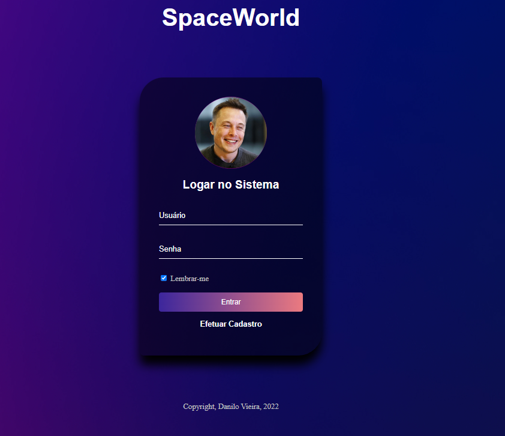

# project-login-system

Link do Projeto: <a href="https://polite-pegasus-e0eb61.netlify.app/">

> Resultado do project-login-system.

### O projeto foi desenvolvido em:

- [x] HTML
- [x] CSS
## 🤝 Colaboradores

Agradecemos à seguinte pessoa que contribuiu para este projeto:

<table>
  <tr>
    <td align="center">
      <a href="https://github.com/danilovgl">
         
        
          <b>Danilo Vieira</b>
        
      </a>
    </td>
    
</table>

[⬆ Voltar ao topo](#project-login-system) 
